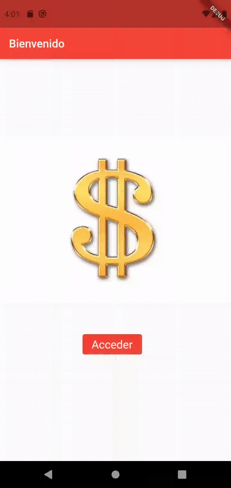

# App bancaria

**Autores:** 
 * :bust_in_silhouette: Jesús González Álvarez     :octocat: [JesusGonzalezA](https://github.com/JesusGonzalezA)
 * :bust_in_silhouette: Alejandro Soriano Morante  :octocat: [Soriano00](https://github.com/Soriano00)

## Descripción
Trabajo para la asignatura Desarrollo de Software en la UGR (Universidad de Granada).
Aplicación para registrar las transacciones de tu cuenta bancaria. Podrás ver 
el saldo de la cuenta en dólares/euros y con una supuesta deducción de impuestos del 10%.

## Diseño
- Patrón observador (Provider)
- Filtros de intercepción (Estilo arquitectónico) 

